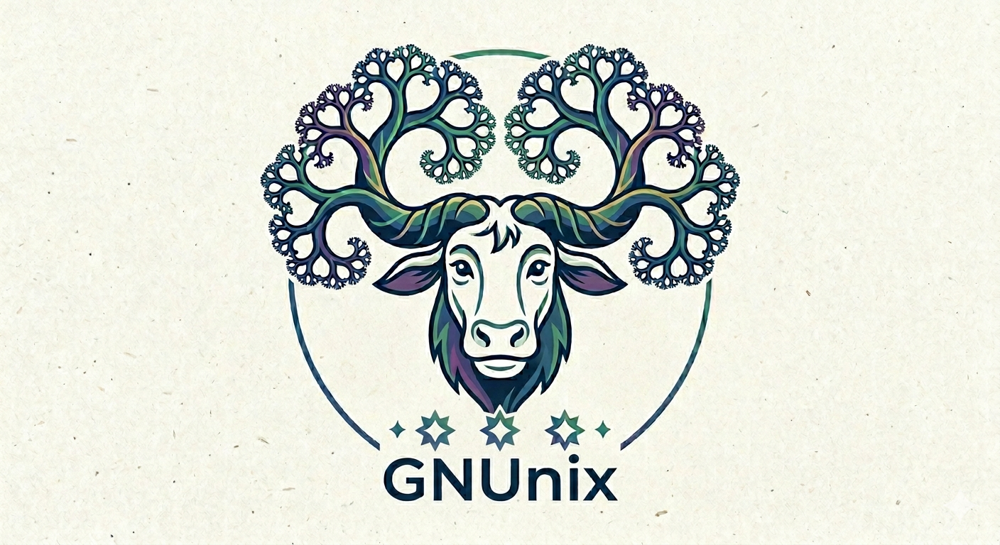

  

# GNUnix

  
  
  
  
  
  
  

Custom Linux distribution for developer workstations on Apple Silicon.

The name is a pun: **GNU**'s-Not-Unix meets **Nix**. The base layer is built
almost entirely from the GNU toolchain (Linux From Scratch, arm64);
the userland is managed by Nix. Read either as GNUnix (GNU + Nix) or as
"GN[U] Unix" — both apply.

- **Base:** Linux From Scratch (arm64), Slackware-style `sysvinit` + BSD `/etc/rc.d/`.
- **Userland:** Nix (multi-user) + home-manager. All apps, the Wayland compositor, dev tools.
- **Delivery:** Tart VM images. Linear image lineage from `gnunix-builder` → `gnunix-base` → `gnunix-minimal` → `gnunix-desktop` → platform variants.

## Philosophy

GNUnix is what you get when you let the 1990s and the 2020s argue for an
afternoon and write down the parts they both agreed on. The 1990s side
of the table is, unapologetically, **Slackware** — the oldest still-
maintained Linux distribution, named after the SubGenius pursuit of
*Slack*, and the spiritual ancestor of basically every design choice in
our base layer. Patrick Volkerding shipped a distro built on the radical
idea that the computer should do its job and then get out of your way so
you can pursue Slack. We are stealing that idea with both hands and a
getaway car. Praise "Bob."

- **GNU coreutils, the way grandma made them.** `ls`, `cat`, `grep`,
  `coreutils`, glibc, GCC — the GNU stack, compiled from source, doing
  exactly the thing it has done well for thirty years. No `busybox`
  shrink-ray, no Rust rewrite of `cp` with telemetry. The Conspiracy
  would love for you to need sixteen background services to print a
  directory listing; we refuse.
- **`sysvinit` + `/etc/rc.d/` shell scripts, because PID 1 should be
  boring.** Slackware-style not by accident: Volkerding named his distro
  after Slack and then proved that an init system you can read in an
  afternoon is the most Slack-maximizing thing on the disk. If you can
  read `sh`, you can read our boot path. No D-Bus in PID 1, no unit
  files, no "declarative supervision tree." There is `rc.S`, `rc.M`,
  `rc.K`, and a directory full of `chmod +x`-toggled scripts. That's
  the whole show. "Bob" would approve.
- **Nix for everything that moves.** The base layer is a museum exhibit;
  the userland is a hardware store. Editors, browsers, language
  toolchains, the Wayland compositor itself — all of it lives in
  `/nix/store`, pinned, reproducible, blow-away-able. Break your config?
  `nix profile rollback`. Try a new compositor? `nix shell nixpkgs#river`.
  Hate the result? Close the terminal. Reproducibility is just Slack
  with receipts.
- **Wayland, not X11.** We picked the modern display server, not the one
  that remembers when monitors were beige. The compositor isn't bundled,
  because the compositor is *your* business: pick `sway`, `river`,
  `hyprland`, `niri`, whatever ships in nixpkgs this week. We just
  guarantee `seatd`/`elogind`, `dbus`, and the portals work.
- **No desktop environment shipped, on purpose.** GNUnix is a chassis,
  not a car. We do not ship GNOME. We do not ship KDE. We ship a working
  TTY, a working Nix, and a working Wayland substrate, and we hand you
  the keys. You want a tiling WM and `foot`? Great. You want a full DE
  somebody else maintains? Also great — it's three lines of
  home-manager away. Less for us to maintain is more Slack for everyone
  involved.
- **The old where it still works, the new where it actually helps.**
  `sysvinit` is forty years old and still boots a computer in under a
  second. Nix is fifteen years old and solved dependency hell. Wayland
  is younger than half our contributors' beards and finally fixed screen
  tearing. We took the parts that aged well and skipped the parts that
  didn't.
- **Simple, direct, objective.** Each piece does one thing. Each
  decision has an ADR explaining why we made it and what we rejected.
  If a future maintainer asks "why is `dbus` started by `rc.dbus` and
  not by an `@reboot` cron entry?", the answer is a one-page Markdown
  file, not folklore. X-Day is coming; you do not want to be debugging
  a unit file when it gets here.

Think of GNUnix as Slackware that read the Nix paper and decided
reproducibility was, in fact, also Slack — or as NixOS that read the
SubGenius pamphlet and decided to relax. Either framing works. Both are
slightly unfair to the original.

## Layout

| Path | Purpose |
|---|---|
| `docs/` | Architecture, ADRs (`adrs/`), runbooks |
| `images/` | One subdir per Tart image, in build order |
| `bundles/` | Reusable Nix expressions |
| `tools/` | Pipeline programs (`build-all`, `promote`, `manifest.json`) |
| `scripts/` | Small auxiliary helpers |
| `tests/` | Boot smoke + Wayland session validation |
| `.github/` | CI workflows + Renovate config |

## Getting started

See `docs/architecture.md` for the two-layer model, `runbook.md` for the
build/test entry points, and `docs/adrs/` for the locked decisions
(init system, package layer, compositor, hardening, kernel architecture,
…).

For Claude Code sessions: read `CLAUDE.md` first.

## References

Projects, papers, and prophets that GNUnix steals from — with credit:

- [**Church of the SubGenius**](https://www.subgenius.com/) — the
  source of all Slack, and the reason Slackware is called Slackware.
  Praise "Bob."
- [**Slackware**](http://www.slackware.com/) — the oldest still-
  maintained Linux distribution. Direct ancestor of our base layer:
  `sysvinit`, BSD-style `/etc/rc.d/`, `chmod +x` to enable services,
  no policy daemons in the boot path.
- [**Linux From Scratch**](https://www.linuxfromscratch.org/) — the
  build recipe for the arm64 base image.
- [**GNU Project**](https://www.gnu.org/) — `coreutils`, glibc, GCC,
  bash, binutils. The entire userland-that-isn't-Nix.
- [**Nix & nixpkgs**](https://nixos.org/) — the package layer and
  the reason userland updates aren't terrifying.
- [**home-manager**](https://github.com/nix-community/home-manager) —
  per-user declarative config on top of Nix.
- [**Wayland**](https://wayland.freedesktop.org/) — the display
  server protocol we target. Compositors are user choice.
- [**sysvinit**](https://github.com/slicer69/sysvinit) — PID 1,
  unchanged in spirit since 1992, still boots faster than anything
  that replaced it.
- [**Tart**](https://tart.run/) — the macOS-native VM runner we ship
  images for.

---

  

